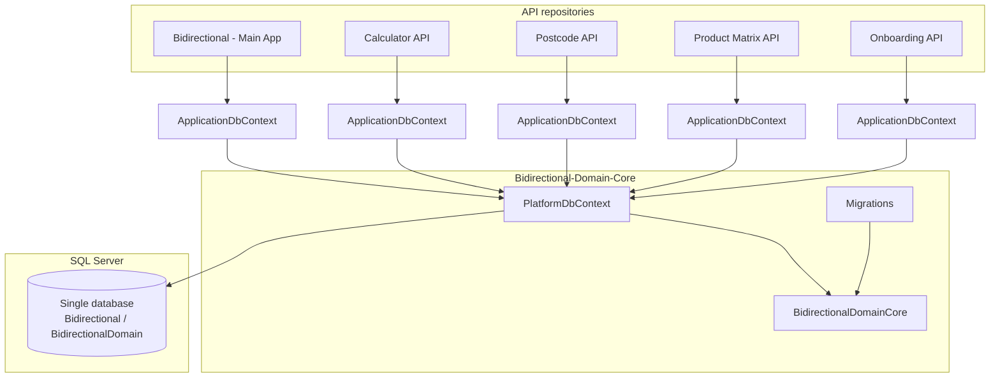

# Database Operations — Platform Guide
  
**Scope:** How database access works after consolidating multiple service databases into one SQL Server database, using the shared **BidirectionalDomainCore** library.  
**Last updated:** May 2026

---

## 1. Executive summary

The platform previously maintained **separate SQL Server databases per microservice** (main app, calculators, postcode, product matrix, onboarding). These have been merged into a **single physical database** (catalog names in configuration are typically `Bidirectional` or `BidirectionalDomain` depending on environment).

All entity definitions, EF Core model configuration, migrations, and cross-cutting persistence behaviour now live in one shared .NET project:

| Item | Location |
|------|----------|
| Shared library | `BidirectionalDomainCore/BidirectionalDomainCore` (`Bidirectional.DomainCore` root namespace) |
| EF Core context | `PlatformDbContext` |
| Migrations | `BidirectionalDomainCore/Migrations/` |
| Consumption | Five API repositories reference this project (project reference today; packaged as a **NuGet-style shared domain library**) |

Each API still exposes its own thin `ApplicationDbContext`, but that type **inherits** `PlatformDbContext` and does **not** own a separate database or duplicate entity model.

---

## 2. What changed (before vs after)

| Aspect | Before (per service) | After (merged platform) |
|--------|----------------------|-------------------------|
| Database count | One catalog per API | **One** catalog for all modules |
| Entity / `DbSet` definitions | Local `Domain` project per repo | **BidirectionalDomainCore** module folders |
| EF migrations | Per API `Infrastructure/Data/Migrations` | **Single** `Migrations` folder in Domain Core |
| DbContext | Service-specific `ApplicationDbContext` | `PlatformDbContext` + thin `ApplicationDbContext` per API |
| Connection string | Service-specific DB name | **Same** `DefaultConnection` target for all services in an environment |
| Secrets | Mixed local implementations | **`ISecretProvider`** + Azure Key Vault via Domain Core |

**Important for clients:** Application services remain independently deployable, but they are **not** independently databased anymore. Schema changes, backups, and migration apply windows are **platform-wide**.

---

## 3. Platform architecture



---

## 4. The six repositories and their roles

| Repository | Role in merged database model |
|------------|-------------------------------|
| **Bidirectional-Domain-Core** | **Source of truth** — entities, `PlatformDbContext`, migrations, Key Vault helpers, interceptors, schema conventions |
| **Bidirectional** (main app) | Broker/admin workflows; largest share of `BidOnboard` entities |
| **Calculator API** | Rates, fees, matrices, discounts (`Calculator` module) |
| **Postcode API** | Postcode tiers, suburbs, classifications (`Postcode` module) |
| **Product Matrix API** | Product rules and classifications (`ProductMatrix` module) |
| **Onboarding API** | Broker onboarding workflows — entities live under **`BidOnboard`** (e.g. `OnboardingWorkflows`), not a separate DB |

**Bounded context rule (unchanged):** APIs must not open connections to another service’s legacy database. They read/write the **shared platform database** only through **their** `IApplicationDbContext` / `ApplicationDbContext`, which maps to the same underlying tables as other services where modules overlap.

---

## 5. BidirectionalDomainCore — shared package approach

### 5.1 Purpose

`BidirectionalDomainCore` is a class library that replaces duplicated `Domain` + `Infrastructure` entity/migration code that previously existed in each API. It is referenced via **project reference** from consuming repos (paths such as `..\..\..\Bidirectional-Domain-Core\BidirectionalDomainCore\BidirectionalDomainCore\BidirectionalDomainCore.csproj`). The layout is suitable for publishing as an internal **NuGet package** so all services pin the same domain version.

### 5.2 What was removed from API `Domain` projects

Per-service copies of entities, constants, interceptors, and local EF migrations were **deleted** in favour of Domain Core types (see git history on `dbMerging` branches). API `Application` layers import Domain Core types via `GlobalUsings` and project references.

---

## 6. `PlatformDbContext` — single EF model

### 6.1 Partial class structure

`PlatformDbContext` is split across partial files for maintainability:

| File | Responsibility |
|------|----------------|
| `Persistence/PlatformDbContext.Bid.cs` | Main `DbSet`s, `OnModelCreating`, `SaveChangesAsync`, encryption, stored procedures |
| `Persistence/PlatformDbContext.Onboarding.cs` | Onboarding-related sets and configuration |
| `Persistence/PlatformDbContext.Calculator.cs` | Calculator module sets |
| `Persistence/PlatformDbContext.ProductMatrix.cs` | Product matrix sets |
| `Persistence/PlatformDbContext.Audit.cs` | Audit-related sets |
| `Persistence/PlatformDbContextFactory.cs` | Design-time factory for migrations |

All modules share **one** EF model snapshot: `Migrations/Platfor
mDbContextModelSnapshot.cs`.

### 6.2 Model configuration highlights

Configured centrally in `OnModelCreating` (Bid partial), including:

- **Column encryption** for sensitive fields (`[EncryptColumn]`, `EncryptionBuilder`)
- **Temporal tables** where applicable
- **Global soft-delete query filters** (`ApplyGlobalSoftDeleteFilters`)
- **String length / charset check constraints** (`ModelBuilderStringConvention`)
- **Fluent configurations** from the Domain Core assembly (`ApplyConfigurationsFromAssembly`)
- **Relationship helpers** (`BidRelationshipConfiguration`, `OnboardingRelationshipConfiguration`, `CascadeDeleteHelper`)
- **MediatR domain events** excluded from persistence (`EntitySchemaConvention.ExcludeDomainEventEntities`)

### 6.3 Save pipeline

- **`AuditableEntityInterceptor`** — sets `Created` / `LastModified`, user ids, Australian/UTC timestamps on `BaseAuditableEntity`
- **`SoftDeleteSaveChangesInterceptor`** — turns deletes into `ISDeleted = true` where applicable
- Some APIs also register **`DispatchDomainEventsInterceptor`** via DI
- `PlatformDbContext` may construct interceptors internally in the full constructor; avoid **duplicate** registration (register either in DI or inside the context, not both)

### 6.4 Stored procedures

`PlatformDbContext` still supports parameterised stored procedure execution (e.g. `ExecuteRawSqlWithMultipleResultsAsync`). **Security rule:** only approved procedures and parameterised calls — never concatenate user input into SQL.

---

## 7. Per-API `ApplicationDbContext` pattern

Each API defines a thin wrapper, for example:

```csharp
public class ApplicationDbContext : PlatformDbContext, IApplicationDbContext
{
    public ApplicationDbContext(/* 9 runtime parameters */)
        : base(/* forwarded */) { }

    public ApplicationDbContext(DbContextOptions<ApplicationDbContext> options, IConfiguration configurationSection)
        : base(options, configurationSection) { }
}
```

## 8. Connection strings and Azure Key Vault

### 8.1 Configuration

All services use **`ConnectionStrings:DefaultConnection`**. Values are either:

- A **full SQL connection string** (local/dev), or  
- A **secret name** stored in Azure Key Vault (staging/production)

Example local catalog: `Initial Catalog=BidirectionalDomain` or `Database=BidirectionalDomain` (environment-specific naming should converge on the single platform catalog per environment).

### 8.2 Resolving secrets

1. Register Key Vault in the API host: `AddAzureKeyVaultSecrets(configuration)` (from `Persistence/KeyVaultServiceCollectionExtensions.cs`).
2. Register `ISecretProvider` → `KeyVaultSecretProvider`.
3. At startup, Infrastructure resolves the connection:

```csharp
dbConnectionString = await secretProvider.GetAsync(
    configuration.GetConnectionString("DefaultConnection") ?? string.Empty);
```

Fallback to the raw config value is used when Key Vault is unavailable (typical local dev).

**Required configuration:** `KeyVault:VaultUri` when Key Vault registration is enabled.

### 8.3 In-memory database

Bid supports `UseInMemoryDatabase` for tests; other APIs may use test-specific catalogs. Production paths must use SQL Server.

---

## 9. Migrations — single source of truth

| Rule | Detail |
|------|--------|
| **Where migrations live** | `BidirectionalDomainCore/Migrations/` only |
| **Design-time factory** | `PlatformDbContextFactory` (`IDesignTimeDbContextFactory<PlatformDbContext>`) |
| **Migrations assembly** | Must be **`typeof(PlatformDbContext).Assembly`** (Domain Core), not an API assembly |
| **Who applies migrations** | Platform / DBA / release pipeline — coordinate once per environment |
| **API teams** | Do **not** add `dotnet ef migrations add` under individual API projects |

### 9.1 Adding a migration (developers)

From the Domain Core project directory:

```powershell
dotnet ef migrations add <MigrationName> `
  --project BidirectionalDomainCore.csproj `
  --context PlatformDbContext `
  --output-dir Migrations
```

Apply to a database:

```powershell
dotnet ef database update `
  --project BidirectionalDomainCore.csproj `
  --context PlatformDbContext
```

Ensure `appsettings.json` / `appsettings.Development.json` in Domain Core (or environment variables) point `DefaultConnection` at the target catalog.

### 9.2 Legacy per-service migrations

Historical migration folders under API `Infrastructure/Data/Migrations` are **obsolete** and removed on merge branches. Do not reintroduce them.

**Client impact:** A deployment that updates any API may require the **platform migration** to have been applied first. Release notes should list Domain Core package version and migration id together.

---

## 10. Cross-cutting persistence behaviour

| Concern | Implementation |
|---------|----------------|
| **Auditing** | `BaseAuditableEntity`, `AuditableEntityInterceptor` |
| **Soft delete** | `ISoftDelete`, global filters, `SoftDeleteSaveChangesInterceptor` |
| **Sensitive columns** | `[EncryptColumn]` + model encryption builder; keys from configuration / Key Vault |
| **Text policy** | `ITextPolicyService`, check constraints on string columns |
| **Current user** | `ICurrentUserService` (implemented per host, e.g. `CurrentUserService` in API Web layer) |
| **Lookup data** | `GeneralLookUp` and related types; extensions in `GeneralLookUpExtension` |
| **Shared DTOs** | Types under `BidOnboard/Persistence/Abstractions/` (e.g. `BaseValueDto`, `ProductLoadingDto`) for calculator/matrix scenarios |

---

## 11. Operational checklist for clients

1. **Provision one SQL database** per environment (naming standard: e.g. `Bidirectional` production catalog).
2. **Run Domain Core migrations** before or as part of rolling out API builds that depend on new schema.
3. **Store connection strings in Key Vault**; config holds secret **names**, not passwords, in non-dev environments.
4. **Backup / restore / DR** is now a **single** database operation — include all modules in RPO/RTO planning.

---

## 12. Developer do’s and don’ts

### Do

- Add entities and configurations in **BidirectionalDomainCore** under the correct module folder/namespace.
- Create **one** EF migration in Domain Core per table schema change.
- Use `IApplicationDbContext` in Application layer handlers — keep CQRS boundaries.
- Use `ISecretProvider` for secrets; use parameterised SQL / EF LINQ only.
- Bump all consuming repos when breaking entity or migration changes ship.

### Don’t

- Create a second database or duplicate `DbContext` model in an API.
- Add migrations under Calculator/Postcode/Bid/Onboarding/ProductMatrix Infrastructure folders.
- Point `MigrationsAssembly` at an API project assembly for production (must be Domain Core).
- Bypass `PlatformDbContext` to open ad hoc SQL against tables owned by another module without platform review.
- Register the same save-changes interceptor twice (DI + `PlatformDbContext` constructor).

---

## 13. Key file reference

| Topic | Path (under `BidirectionalDomainCore/`) |
|-------|----------------------------------------|
| DbContext | `Persistence/PlatformDbContext.*.cs` |
| Migrations | `Migrations/` |
| Design-time factory | `Persistence/PlatformDbContextFactory.cs` |
| Key Vault DI | `Persistence/KeyVaultServiceCollectionExtensions.cs` |
| Secret abstraction | `BidOnboard/Persistence/Abstractions/ISecretProvider.cs` |
| Auditing interceptor | `BidOnboard/Persistence/Interceptors/AuditableEntityInterceptor.cs` |
| Soft delete interceptor | `Persistence/Interceptors/SoftDeleteSaveChangesInterceptor.cs` |
| Auditable base type | `Common/BaseAuditableEntity.cs` |

---

## 14. Glossary

| Term | Meaning |
|------|---------|
| **Platform database** | Single SQL Server catalog holding all module tables |
| **Domain Core** | `BidirectionalDomainCore` shared library (`Bidirectional.DomainCore`) |
| **Module** | BidOnboard, Calculator, Postcode, ProductMatrix, or shared Common |
| **PlatformDbContext** | Unified EF Core `DbContext` for the entire model |

---

*For questions about release coordination or environment-specific catalog names, contact the platform team owning **Bidirectional-Domain-Core** migrations.*
